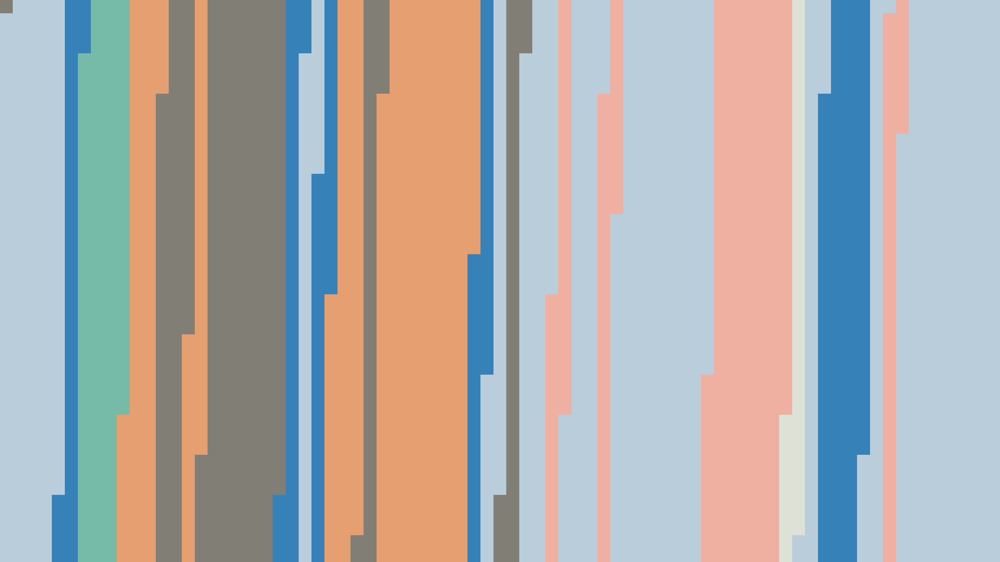
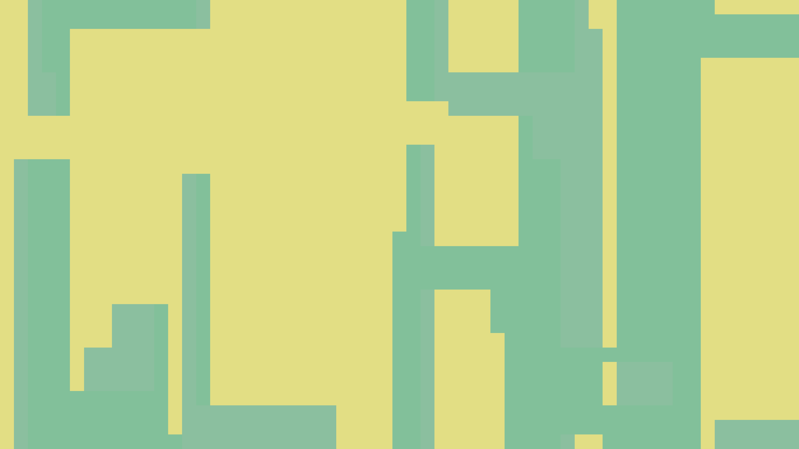
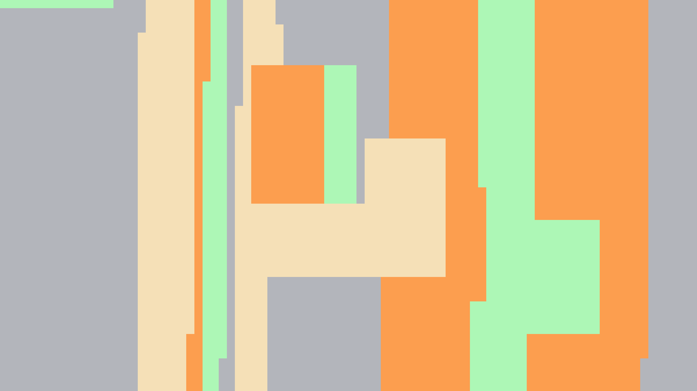

# Individual Study Media Informatics

by Maximilian Wolfs

Program: Digital Media Master
Course: Invididual Study Media Informatics
Lecturer: Frieder Nake

## 1. Concept

With the Individual study I want to examine the relation between 

process - real time

meditative stimmung

Baumgarten

ästhethische erfahrung als epistemeologische möglichkeit neben der kognitiven um erkenntnis zu gewinnen.

impliziert die unlesbarkeit von mustern ästhetische erfahrung?


## 2. Surface - Output

### 2.1. Slow

The integration









### 2.2. Cellular Automation


## 3. Subface - Code

```java
int seed = 0;
// impliziert die unlesbarkeit von mustern ästhetische erfahrung?
// appersu - in den text kursiv an den rand
String hash;
char[] dna;

int multiplier;

int r = Math.round(random(0, 128));

color[] colors = {
  #F4F1BB, #EB5160, #7D82B8, #613F75, #75BBA7, #D7DAE5, #B9CDDA, #8A84E2, #E59F71, #BA5A31, #EFB0A1, #F3F8F2, 
  #3581B8, #FCB07E, #DEE2D6, #12100E, #817F75, #FFEE93, #B3B5BB, #ADF7B6, #FC9E4F, #F5E0B7, #8BBF9F, #82D4BB, 
  #82C09A, #1E3888, #E2DE84, #47A8BD, #AF9164, #031927, #E3C567, #F3DE8A, #F2F3AE, #FED766, #EF476F
}; 

void setup() {
  //size(1000, 1000);
  fullScreen();
  noCursor();
  frameRate(1);
  //noLoop();
  regenerate();
}

void draw() {
  background(colors[0]); 
  
  //println(dna[r]);

  //dna[0]++;

  
 // println(dna[r]);
 
  hash = "";
  
  for (int i = 0; i < dna.length; i++) {
    hash += (String.valueOf(dna[i]));
  }

 
  color[] colors = getColors(hash);

  int[] transformation1 = transformation1(hash, colors);
  int[][] transformation2 = transformation2(transformation1);

  int ca = hash.chars().sum() % transformation2[0].length + 1;

  for (int i = 0; i < frameCount % 60; i++) { // ca frameCount % 60
  multiplier = floor(random(i,100));
    transformation2 = transformation3(transformation2, colors.length);
  }
  showState(transformation2, colors);
  
}

void keyReleased() {
  if (keyCode == LEFT) {
    seed--;
    regenerate();
  }
  if (keyCode == RIGHT) {
    seed++;
    regenerate();
  }
  if (keyCode == DOWN) {
    dna[0]++;
  }
    if (keyCode == UP) {
    dna[0]--;
  }
  if (key == ' ') {
    regenerate();
  }

  if (key == 's') {
    saveFrame("export/seed_" + nf(seed, 4) + ".png");
  }
  
  redraw();
}

void regenerate () {
  
  hash = sha512(str(seed));
  
  dna = new char[hash.length()];
  
  for (int i = 0; i < hash.length(); i++) {
    dna[i] = hash.charAt(i);
  }
  
  hash = "";
  

  }
  

void showState(int[][] state, color[] colors) {
  for (int i = 0; i < state.length; i++) {
    for (int j = 0; j < state[i].length; j++) {
      fill(colors[state[i][j]]);
      noStroke();

      float dx = width / (float) state.length;
      float dy = height / (float) state[i].length;
      float x = dx * i;
      float y = dy * j; 
      rect(floor(x), floor(y), ceil(dx), ceil(dy));
    }
  }
}


color[] getColors(String hash) {
  int colorCount = hash.chars().sum() % 7 + 1;
  int colorRange = hash.chars().sum() % 98;
  int indexJump = hash.chars().sum() % 2 + 1;

  int length = min(colorCount, colors.length);
  length = max(3, colorCount);

  int start = floor(float(colors.length) * float(colorRange) / 99.0);

  color[] trimmedColors = new color[length];

  for (int i = 0; i < length; i++) {
    int copyIndex = (start + i * indexJump) % colors.length;
    trimmedColors[i] = colors[copyIndex];
  }
  return trimmedColors;
}

int[] transformation1(String hash, color[] colors) {
  ArrayList<Integer> convertedCharacters = new ArrayList();
  for (int i = 0; i < hash.length(); i++) {
    int position = int(hash.charAt(i));

    // Converting ASCII DEC values to useful values
    if (position >= 48 && position <= 57) {
      position -= 48;
    } else {
      position -= 55;
    }

    int colorIndex = position % colors.length;

    if (i > 0) {    
      //int multiplier = int(hash.charAt(i-1)) % max(position, 1);
      //int multiplier = position % max(int(hash.charAt(i-1)), 1);
      for (int j = 0; j < multiplier; j++) {
        convertedCharacters.add(colorIndex);
      }
    } else {
      convertedCharacters.add(colorIndex);
    }
  }

  int[] graphics = new int[convertedCharacters.size()];
  for (int i = 0; i < convertedCharacters.size(); i++) {
    graphics[i] = convertedCharacters.get(i);
  }
  return graphics;
}

int[][] transformation2(int[] state) {

  // https://math.stackexchange.com/a/2570649
  float ratio = (float) width / height;
  float elementsOnXAxisFloat = sqrt((state.length * ratio));
  int elementsOnXAxis = ceil(elementsOnXAxisFloat);
  int elementsOnYAxis = ceil(state.length / (float) elementsOnXAxis);
  while (elementsOnXAxis < elementsOnYAxis * ratio) {
    elementsOnXAxis++;
    elementsOnYAxis = ceil(state.length / (float) elementsOnXAxis);
  }

  int[][] neighbors = new int[elementsOnXAxis][elementsOnYAxis];
  for (int i = 0; i < elementsOnXAxis; i++) {
    for (int j = 0; j < elementsOnYAxis; j++) {
      if (i * elementsOnYAxis + j < state.length) {
        neighbors[i][j] = state[i * elementsOnYAxis + j];
      } else {
        neighbors[i][j] = 0;
      }
    }
  }

  return neighbors;
}

int[][] transformation3(int[][] state, int neighborhoods) {
  int[][] nextState = new int[state.length][state[0].length];
  for (int i = 0; i < state.length; i++) {
    for (int j = 0; j < state[i].length; j++) {
      if (i > 0 && state[i-1][j] == (state[i][j] + 1) % neighborhoods) {
        nextState[i][j] = state[i-1][j];
      } else if (i < state.length-1 && state[i+1][j] == (state[i][j] + 1) % neighborhoods) {
        nextState[i][j] = state[i+1][j];
      } else {
        nextState[i][j] = state[i][j];
      }
    }
  }

  return nextState;
}

// --- SHA-512

import java.nio.charset.StandardCharsets; 
import java.security.MessageDigest; 
import java.security.NoSuchAlgorithmException; 

public String sha512(String passwordToHash) {
  String salt = "";

  String generatedPassword = null; 
  try {
    MessageDigest md = MessageDigest.getInstance("SHA-512"); 
    md.update(salt.getBytes(StandardCharsets.UTF_8)); 
    byte[] bytes = md.digest(passwordToHash.getBytes(StandardCharsets.UTF_8)); 
    StringBuilder sb = new StringBuilder(); 
    for (int i=0; i< bytes.length; i++) {
      sb.append(Integer.toString((bytes[i] & 0xff) + 0x100, 33).substring(1));
    }
    generatedPassword = sb.toString();
  } 
  catch (NoSuchAlgorithmException e) {
    e.printStackTrace();
  }
  return generatedPassword;
}
```

## 4. Conclusion

